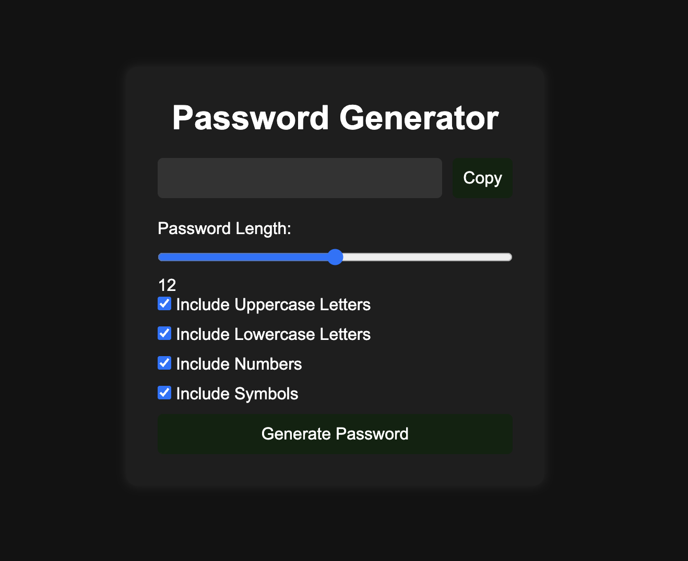
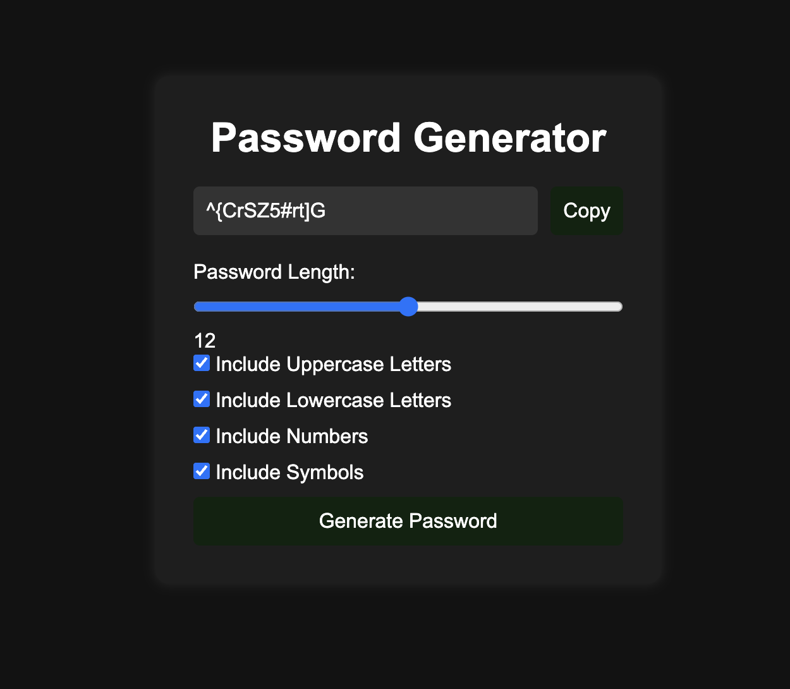

# 🔐 Password Generator

A modern and responsive Password Generator web application built using **HTML, CSS, and JavaScript**.  
This project helps users generate strong and secure passwords with customizable options such as uppercase letters, lowercase letters, numbers, and symbols.

---

## 🌐 Live Demo

👉 [View Live Project](https://Manya452.github.io/password-generator/)

---

## 🚀 Features

✅ Generate strong random passwords  
✅ Adjustable password length  
✅ Include:
- Uppercase Letters
- Lowercase Letters
- Numbers
- Symbols

✅ One-click copy to clipboard  
✅ Responsive and modern UI  
✅ Beginner-friendly JavaScript project

---

## 🛠️ Tech Stack

- HTML5
- CSS3
- JavaScript (ES6)

---

## 📸 Screenshots

### 🖥️ Main Interface



---

### 🔑 Generated Password Example



---

## 📂 Project Structure

```bash
password-generator/
│
├── home.png
├── generated-password.png
├── index.html
├── style.css
├── script.js
└── README.md
```

---

## ⚙️ How It Works

1. Select the password length using the slider
2. Choose character types:
   - Uppercase
   - Lowercase
   - Numbers
   - Symbols
3. Click on **Generate Password**
4. Copy the generated password instantly

---

## 🧠 JavaScript Concepts Used

- DOM Manipulation
- Event Listeners
- Random Password Logic
- String Manipulation
- Clipboard API
- Responsive UI Design

---

## 💡 Future Improvements

- Password Strength Meter
- Dark / Light Mode
- Password History
- Better UI Animations
- Mobile Optimization

---

## 📌 Installation & Setup

Clone the repository:

```bash
git clone https://github.com/Manya452/password-generator.git
```

Open the project folder and run:

```bash
index.html
```

OR use **Live Server** in VS Code.

---

## 👩‍💻 Author

**Manya Gupta**

GitHub: https://github.com/Manya452

---

## ⭐ Support

If you like this project, give it a ⭐ on GitHub.